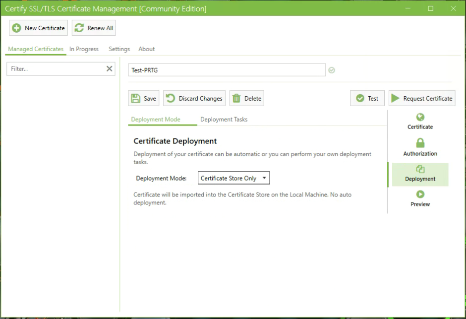
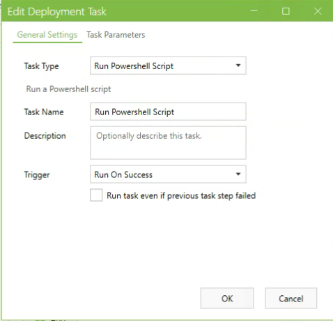

# Certify the Web & PRTG

This is a post request script to install a certificate aquired using Certify the Web into [PRTG](https://www.paessler.com/prtg).

## Deprecation / Retirement

Since creating this script, Certify the Web has expanded Deployment Tasks to include "Deploy to Generic Server (multi-purpose)" which can write the needed files to PRTG's directory. Using this Deployment Task followed by a Run task to restart PRTG should be sufficient. As of Feburary 2022, I don't have plans on improving this script. If you find it useful over Certify's built in tasks, please submit a [GitHub Issue](https://github.com/andyzib/LetsEncrypt-PRTG/issues/new/choose) with your feature/enhancment requests. Thanks!  

## Requirements

* [PowerShell 5.1](https://docs.microsoft.com/en-us/skypeforbusiness/set-up-your-computer-for-windows-powershell/download-and-install-windows-powershell-5-1)
* You should already have Windows PowerShell 5.1 if you're running Windows 10 Anniversary Update or Windows Server 2016.
* [PSPKI](https://www.pkisolutions.com/tools/pspki) module that is available in the [PowerShell Gallery](https://www.powershellgallery.com/packages/PSPKI).
* Tested/Verified with Certify the Web version 4.1.6.0 and 5.5.5.0.
* Tested/Verified on Windows 10, Server 2012 R2, Server 2016, and Server 2019.

## Installation

1. If running on Windows 10, Install RSAT: Active Directory Certificate Services (Settings > Apps & features > Optional features)
2. Open PowerShell as an administrator and run Install-Module PSPKI
3. Save the script to a directory (Example: E:\Scripts\Certify-PRTG\Certify-PRTG.ps1)
4. Verify that $PRTGCertRoot variable matches your PRTG installation.

## Running Certify-PRTG.ps1

The script must be configured as a Deployment Task in the Certify GUI.

1. Configure obtaining your certificate in Certify. See [Certify The Web - Docs](https://docs.certifytheweb.com/docs/intro) for instructions.
2. Deployment Mode: Certificate Store Only is the only option I've tested.  

3. Under Deployment Tasks, add a Run Powershell Script task.  

4. Set Trigger to "Run On Success."  

5. Use a security principal with appropriate permissions for your environment.
6. Pass Result as First Argument must be checked.
7. Request/Renew certificate as normal. If successful, cert will be added to PRTG and PRTG will be restarted.  

