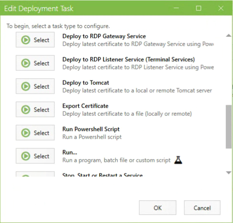
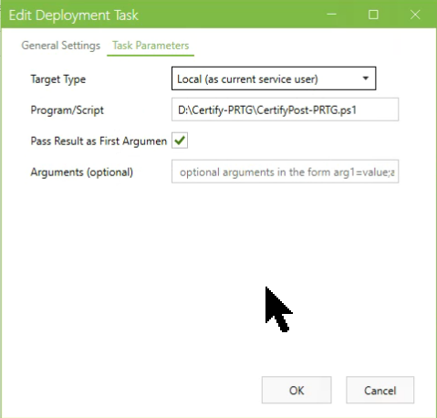

# Let's Encrypt PRTG
This is a collection of scripts to automatically install a Let's Encrypt certificate for [PRTG](https://www.paessler.com/prtg).

# Certify the Web: Certify-PRTG.ps1
Post request script to install a Let's Encrypt certificate obtained with Certify the Web in PRTG. 

## Requirments
* [PowerShell 5.0](https://docs.microsoft.com/en-us/skypeforbusiness/set-up-your-computer-for-windows-powershell/download-and-install-windows-powershell-5-1)
* You should already have Windows PowerShell 5.1 if you're running Windows 10 Anniversary Update or Windows Server 2016.
* [PSPKI](https://www.pkisolutions.com/tools/pspki) module that is availabe in the [PowerShell Gallery](https://www.powershellgallery.com/packages/PSPKI/3.4.2.0). 
* Tested/Verfied with Certify the Web version 4.1.6.0. 
* Tested/Verfied on Server 2012 R2 with PowerShell 5. 

## Installation
1. Open PowerShell as an administrator and run Install-Module PSPKI
2. Save the script to a directory (Example: E:\Scripts\Certify-PRTG\Certify-PRTG.ps1)
3. Verify that $PRTGCertRoot variable matches your PRTG installation. 

## Running Certify-PRTG.ps1
The script must be configured as a Deployment Task in the Certify GUI. 
1. Configure obtaining your certificate in Certify. 
2. Deployment Mode: Certificate Store Only is the only option I've tested. 

3. Under Deployment Tasks, add a Run Powershell Script task. 

4. Only trigger script on success. 

5. Use a security principal with appropiate permissions for your environment. 
6. Pass Result as First Argument must be checked. 
7. Request/Renew certificate as normal. If successful, cert will be added to PRTG and PRTG will be restarted. 

# Windows ACME Simple (WACS)
A script for WACS is on my todo list. 
https://github.com/PKISharp/win-acme
